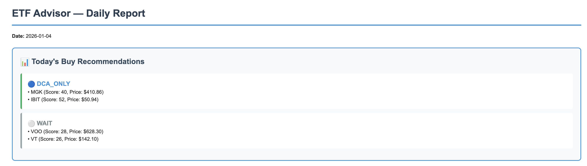
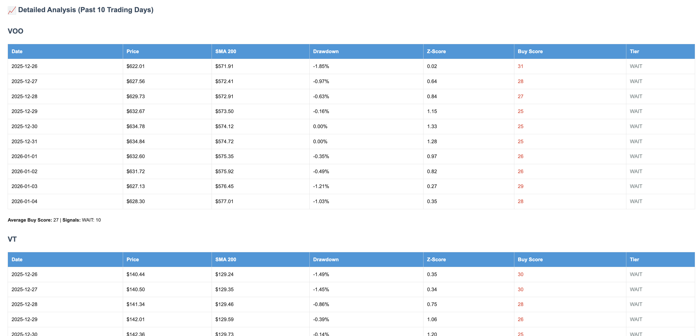

# etf-signal-service

This is a personal service that sends me emails with buy signals for long-term investing. 

The service runs automatically Monday-Friday at 3 PM EST via AWS Lambda (triggered by EventBridge Scheduler) and sends email reports through AWS SES. Each daily email includes today's buy recommendations (STRONG_BUY, BUY, DCA_ONLY, WAIT) along with analysis of the past 10 trading days showing price, indicators, and buy scores.

## Algorithm Details

The buy signal algorithm is implemented in [`algorithm_backtest.ipynb`](algorithm_backtest.ipynb), which contains:
- Historical backtesting on 5 years of data
- Buy Score calculation (0-100) based on SMA 200, 6-month drawdown, and 30-day z-score
- Tier classification (STRONG_BUY, BUY, DCA_ONLY, WAIT)
- Performance analysis and forward return statistics

## My investing setup

I use this service to support a simple, rules-based strategy across two accounts.

### Roth IRA
- 100% VT  
- Long-term, global exposure  
- No trading, no timing, just consistent contributions  

### Personal (taxable) account
- 95% MGK  
- 5% IBIT  
- Growth-focused with a small high-risk allocation  

## How I use signals

These signals are not trade commands.  
They are simply a way for me to decide when it feels reasonable to add new money.

I only buy when:
- I have new income to invest  
- The buy score crosses a threshold I'm comfortable with  

The goal is to stay consistent, avoid emotional decisions, and not overthink day-to-day market moves.

This system is meant for long-term accumulation, not short-term trading.
